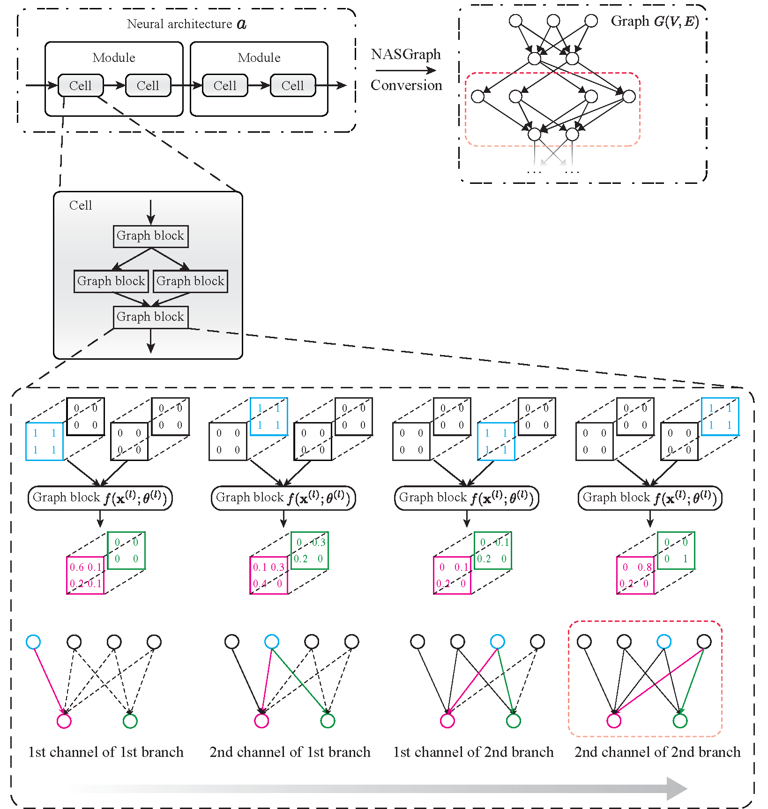

<h1  align="center" > Graph is All You Need? Lightweight Data-agnostic Neural Architecture Search without Training </h1>

This repository is the official Pytorch implementation of [Graph is All You Need? Lightweight Data-agnostic Neural Architecture Search without Training]().

<h3> Quick Links: </h3>

[**Introduction**](#introduction)
| [**Stup Virtual Environment**](#setup-virtual-environment)
| [**Download Benchmarks**](#download-benchmarks)
| [**Usage**](#usage)
| [**Misc**](#misc)
| [**License**](#license)

## Introduction

We propose a novel framework, *NASGraph*, to achieve training-free neural architecture search (NAS). *NASGraph* framework converts neural architecture, $a$, to graph $G(V, E)$. 
<div align="center">
  
</div>
<br>

## Setup Virtual Environment

1. Create virtual environment
```
conda create -n nas2graph -c anaconda python=3.6 tensorflow-gpu=1.15.0 pytorch=1.2.0
conda activate nas2graph
```

2. Install NAS-Bench-101
```
git clone https://github.com/google-research/nasbench
cd nasbench
python -m pip install .
```

3. Install NAS-Bench-201
```
git clone https://github.com/D-X-Y/NAS-Bench-201
cd NAS-Bench-201
python -m pip install .
```

4. Install other related packages
```
pip install -r requirements.txt
```

## Download Benchmarks

- Download NAS-Bench-101 benchmark file: [nasbench_only108.tfrecord](https://storage.googleapis.com/nasbench/nasbench_only108.tfrecord)

Credit to Git repo: [NASBench: A Neural Architecture Search Dataset and Benchmark](https://github.com/google-research/nasbench)

- Download NAS-Bench-201 benchmark file: [NAS-Bench-201-v1_1-096897.pth](https://drive.google.com/open?id=16Y0UwGisiouVRxW-W5hEtbxmcHw_0hF_)

Credit to Git repo: [NAS-BENCH-201: Extending the Scope of Reproducible Neural Architecture Search](https://github.com/D-X-Y/NAS-Bench-201)

- Download TransNAS-Bench-101 benchmark file: [transnas-bench_v10141024.pth](https://drive.google.com/drive/folders/1HlLr2ihZX_ZuV3lJX_4i7q4w-ZBdhJ6o?usp=share_link)

Credit to Git repo: [ TransNAS-Bench-101: Improving Transferrability and Generalizability of Cross-Task Neural Architecture Search](https://github.com/yawen-d/TransNASBench)

- Download NDS benchmark file: [data.zip](https://dl.fbaipublicfiles.com/nds/data.zip)

Credit to Git repo: [On Network Design Spaces for Visual Recognition](https://github.com/facebookresearch/nds)

## Usage

1. (Optional) Extract archtecture information of NAS benchmarks and store it in `<nas_info_file>` (We provide extracted files in `./data/` directory)

```bash
bash extract_arch_info.sh <output_dir> <nas_benchmark_name> <nas_benchmark_file>
```

2. Convert neural architectures to graphs

```bash
bash convert_archs.sh <output_dir> <nas_benchmark_name> <nas_benchmark_file> <nas_info_file>
```

3. Compute graph properties (`<file_pattern_of_graph_file>` depends on the graph files generated in the previous step. For NAS-Bench-101 and NAS-Bench-201, it is `modelID_aggmodedepthwise_directedTrue.gpickle`. For Trans-NAS-Bench-101, it is `modelID_<task>_directedTrue.gpickle`)

```bash
bash compute_graph_props.sh <working dir> <output_dir> <file_pattern_of_graph_file> <nas_benchmark_name>
```


## Misc

To accelerate the conversion process in Usage 2, one can:

- Use surrogate model by changing the number of cells `--ncells` or number of channels `--stemchannels` 
- Use computation nodes. Conversion is independent for each neural architecture and our implementation supports conversion subsets of neural architectures by changing `--index-st` and `--index-ed` 


## License

The project is released under [APACHE License](LICENSE).

